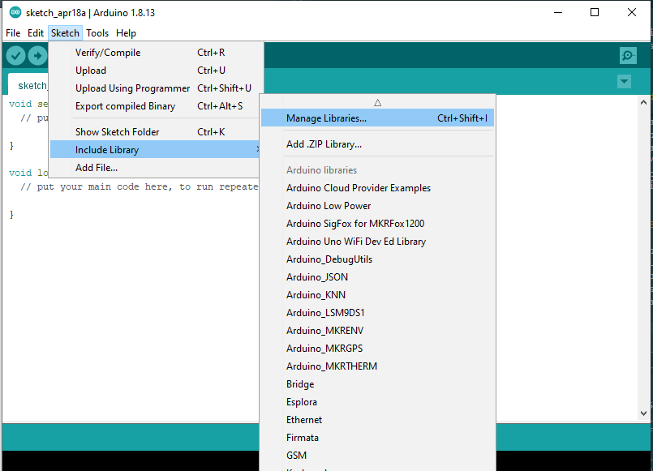

# Interface BMP180 with flight computer

BMP180 is a basic sensor that is to measure atmospheric pressure and temperature. From atmospheric pressure measurements one can be able to get the height above sea level of where the BMP180 is stationed thus elevation in metres.

Air pressure reduces as we move far away from the sea level. At sea level the air pressure is maximum while at the top of any mountain e.g Mt Kenya the air pressure is considerably low. This relation in the difference in air pressure can help us get the altitude of a specifi place. In short, we can use the BMP180 sensor as an **Altimeter**.

Also, atmospheric conditions change with change in air pressure, hence it can be used to monitor weather.

BMP180 is simple to use, pre-calibrated and don’t require extra components so you can start measuring barometric pressure, altitude and temperature in no time.

## Hardware overiew


~From learn.sparkfun.com~

BMP180 can measure barometric pressure from 300 to 1100 hPa (9000m to -500m above sea level), and temperature from -40°C to 85°C with ±1.0°C accuracy.

### Power

The module comes with an on-board LM6206 3.3V regulator, so you can use it with a 5V logic microcontroller like Arduino without worry. We had problems using 5V so we worked with 3.3V and it worked well.
The BMP180 consumes less than 1mA during measurements and only 5μA during idle.

### I2C interface

The module features a simple two-wire 3.4Mhz I2C interface which can be easily interfaced with any microcontroller of your choice. This module has a hardwired I2C address and is set to 0x77HEX. I2C allows you to have multiple devices connected to the same two lines (collectively called a bus)

### Pinout


The connections are:

1. VCC is connected to +5V

2. GND is connected to ground

3. SDA is Serial Data pin (I2C interface)

4. SCL is Serial Clock pin (I2C interface)

5. 3.3V can power module by connecting +3.3V to this pin.

### Connection

TODO: @Mike-Kimani Fritzing schematic for connecting with esp32

## Procedure

1. Install the Arduino IDE

If you don't already have the Arduino IDE (Integrated Development Environment) installed, download the version for your system (Windows, Mac, Linux) from [here](http://arduino.cc/en/Main/Software) and install it following the instructions on that site.

2. Install the SFE_BMP180 Library

To install the library navigate to the Sketch > Include Library > Manage Libraries… Wait for Library Manager to download libraries index and update list of installed libraries.



Filter your search by typing ‘bmp180’. There should be a couple entries. Look for Adafruit BMP085 Library by Adafruit. Click on that entry, and then select Install.


3. Get readings

The following sketch will give you complete understanding on how to read temperature and barometric pressure from BMP180 module and can serve as the basis for more practical experiments and projects.

```c++
#include <Wire.h>
#include <Adafruit_BMP085.h>

/*************************************************** 
  This is an example for the BMP085 Barometric Pressure & Temp Sensor

  Designed specifically to work with the Adafruit BMP085 Breakout 
  ----> https://www.adafruit.com/products/391

  These displays use I2C to communicate, 2 pins are required to  
  interface
  Adafruit invests time and resources providing this open source code, 
  please support Adafruit and open-source hardware by purchasing 
  products from Adafruit!

  Written by Limor Fried/Ladyada for Adafruit Industries.  
  BSD license, all text above must be included in any redistribution
 ****************************************************/

// Connect VCC of the BMP085 sensor to 3.3V (NOT 5.0V!)
// Connect GND to Ground
// Connect SCL to i2c clock - on '168/'328 Arduino Uno/Duemilanove/etc thats Analog 5
// Connect SDA to i2c data - on '168/'328 Arduino Uno/Duemilanove/etc thats Analog 4
// EOC is not used, it signifies an end of conversion
// XCLR is a reset pin, also not used here

Adafruit_BMP085 bmp;
  
void setup() {
    Serial.begin(9600);
    if (!bmp.begin()) {
        Serial.println("Could not find a valid BMP085 sensor, check wiring!");
        while (1) {}
    }
}
  
void loop() {
    Serial.print("Temperature = ");
    Serial.print(bmp.readTemperature());
    Serial.println(" *C");
    
    Serial.print("Pressure = ");
    Serial.print(bmp.readPressure());
    Serial.println(" Pa");
    
    // Calculate altitude assuming 'standard' barometric
    // pressure of 1013.25 millibar = 101325 Pascal
    Serial.print("Altitude = ");
    Serial.print(bmp.readAltitude());
    Serial.println(" meters");

    Serial.print("Pressure at sealevel (calculated) = ");
    Serial.print(bmp.readSealevelPressure());
    Serial.println(" Pa");

  // you can get a more precise measurement of altitude
  // if you know the current sea level pressure which will
  // vary with weather and such. If it is 1015 millibars
  // that is equal to 101500 Pascals.
    Serial.print("Real altitude = ");
    Serial.print(bmp.readAltitude(101500));
    Serial.println(" meters");
    
    Serial.println();
    delay(500);
}
```

Here’s how the output looks like in the serial monitor.

TODO: @Mike-Kimani Screenshot of output readings

## Explanation

The sketch starts with including our libraries Wire.h and Adafruit_BMP085.h.

```c++
#include <Wire.h>
#include <Adafruit_BMP085.h>
```

Next, we define seaLevelPressure_hPa variable needed to calculate the altitude. Change it to current sea level pressure at your location.
We also create a bmp object so that we can access functions related to it.

```c++
#define seaLevelPressure_hPa 1024

Adafruit_BMP085 bmp;
```

In setup function of code we initialize the serial communication with PC and call the `begin()` function. The `begin()` function initializes I2C interface and checks if the chip ID is correct. It then resets the chip using soft-reset & waits for the sensor for calibration after wake-up.

```c++
Serial.begin(115200);

if (!bmp.begin()) {
    Serial.println("Could not find a valid BMP085 sensor, check wiring!");
    while (1) {}
}
```

In loop function, we use following functions to read temperature barometric pressure and altitude from the BMP180 module.

1. `readTemperature()` function returns the temperature from the sensor.

2. `readPressure()` function returns the barometric pressure from the sensor.

3. `readAltitude(seaLevelPressure_hPa * 100)` function calculates the altitude (in meters) from the specified atmospheric pressure (in hPa).

4. `readSealevelPressure()` function calculates the sea-level pressure (in hPa).

## Tips and tricks

1. Give it the right voltage: The BMP180 will operate on voltages from 1.8V to 3.6V. We recommend operating it at 3.3V. Never connect the + header to voltages higher than 3.6V!.

2. Give it air: Remember that the BMP180 needs access to ambient air to measure its pressure, so don't put it in a sealed case.

3. Exposure to fast-moving air or wind can cause momentary pressure variations that will affect your readings. Shield the device from strong air currents.

4. Keep it cool: Because an accurate temperature reading is needed to measure the pressure, try not to expose the device to rapid temperature changes, and keep it away from nearby hot parts and other heat sources.

5. Don't blind it: Surprisingly, the silicon within the BMP180 is sensitive to light, which can enter the device through the hole on the top of the chip. For maximum accuracy, shield the chip from ambient light.
